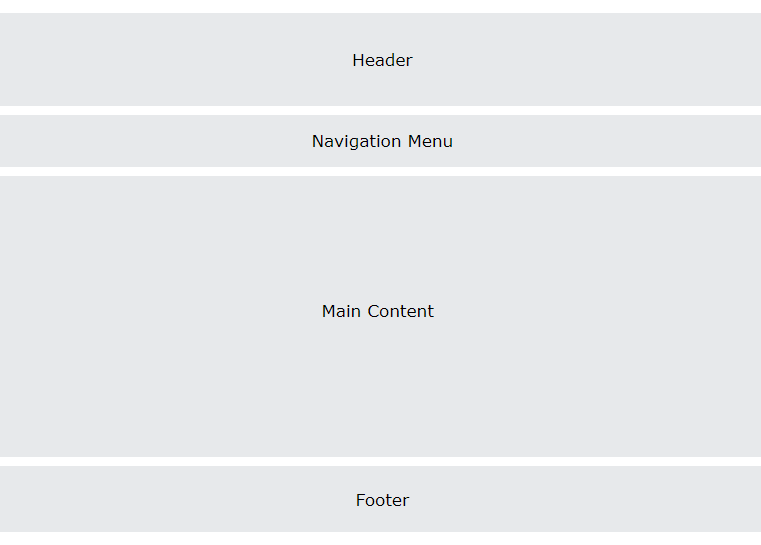
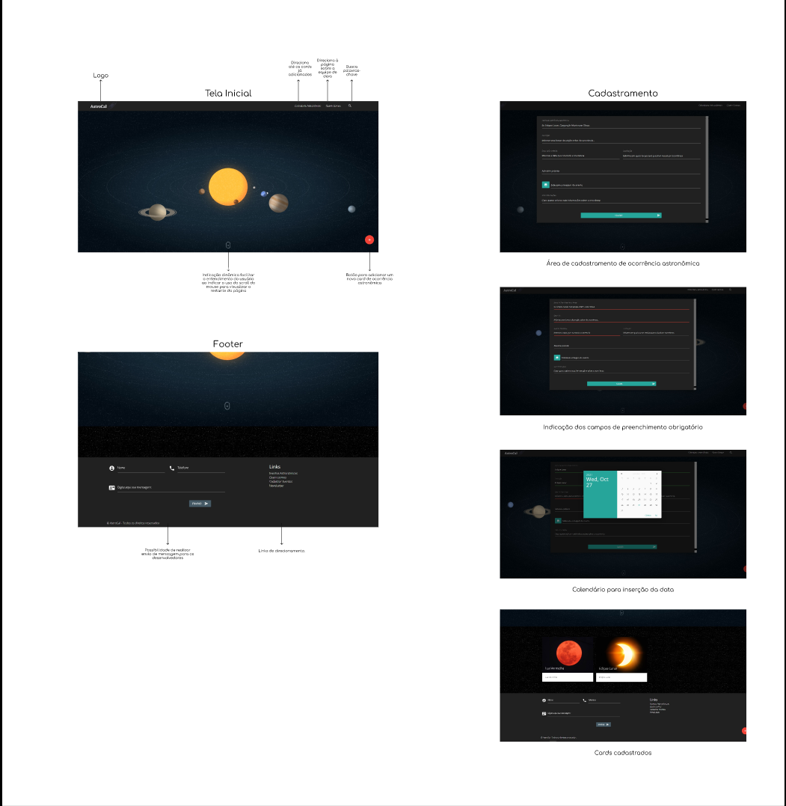

# Template Padrão da Aplicação

O padão de layout a ser utilizado será baseado no seguinte modelo:

A seguir será apresentado o modelo que pretendemos seguir. Tendo em vista a adição do back-end e a reformulação do site o seguinte modelo poderá ser alterado e este documento futuramente atualizado.

