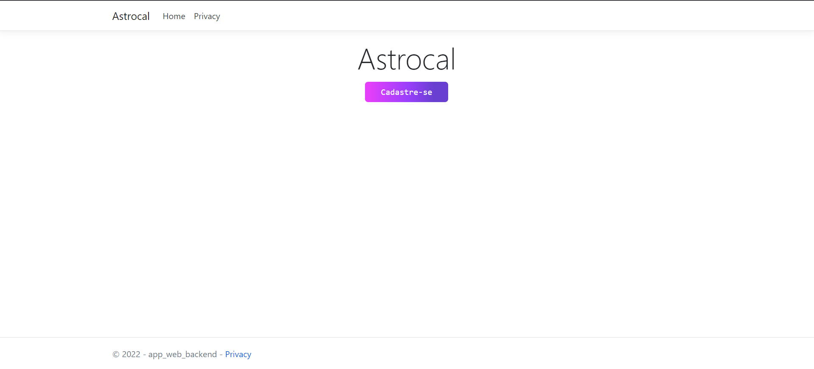
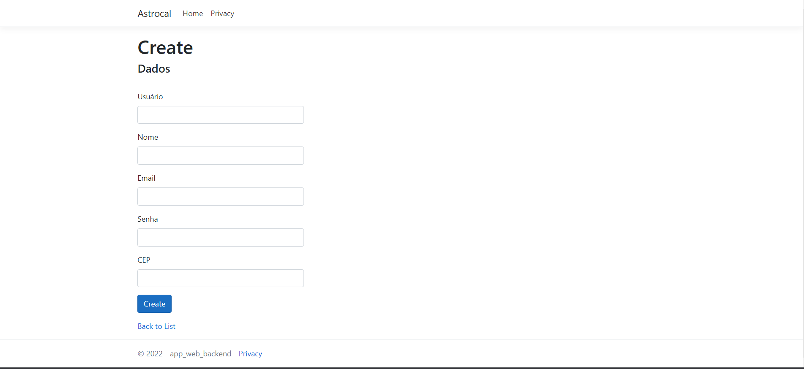
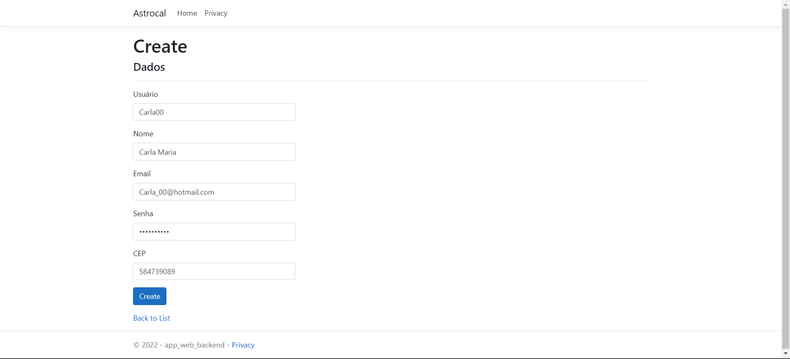

# Programação de Funcionalidades

Foi desenvolvido a primeira funcionalidade - ID RF-001 - Permitir o cadastro do usuário na plataforma - que possui alta prioridade. A seguir consta as imagens referentes a funcionalidade desenvolvida.

Link do site: https://astrocal.azurewebsites.net/

