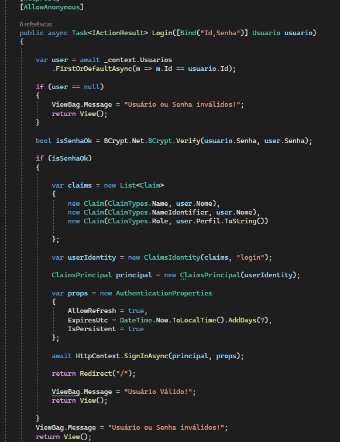
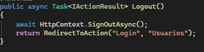
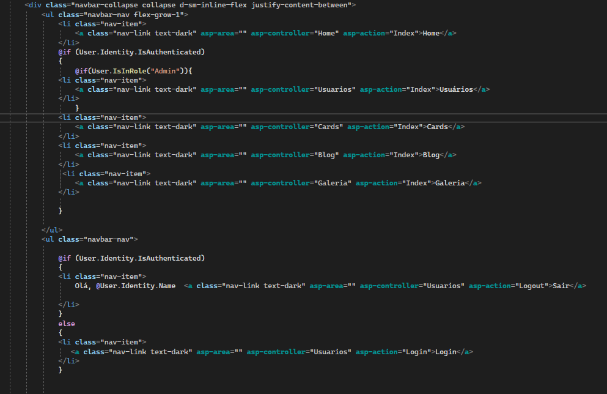

# Programação de Funcionalidades

Diferença de acesso de acordo com o perfil do usuário

Foram desenvolvidas as seguintes funcionalidades:
- ID RF-001 - Permitir o cadastro do usuário na plataforma 

Foi realizada a diferenciação de perfil a partir da inserção dos ENUMs Admin e User.

Ao ser realizado o cadastro pode ser selecionada o tipo do usuário.

- ID RF-002	Permitir login de usuários cadastrados

No trecho de código acima pode-se verificar a implementação do código Hash no controller do usuário para permitir a criptografia da senha.

No trecho acima pode-se verificar a implementação do Login dentro do controller usuário.

No trecho acima pode-se verificar a implementação do Logout dentro do controller usuário.

Pode-se verificar no trecho acima as condições para acesso das páginas, onde só o administrados possui acesso a página de usuários.

-ID RF-003	Permitir o salvamento dos dados cadastrados no banco de dados	

-ID RF-004	Permitir ao usuário inserir comentários	

-ID RF-005	Permitir ao usuário inserir fotos	

-ID RF-006	Permitir ao usuário cadastrar ocorrências astronômicas	

Infelizmente a plataforma do git suporta uma quantidade muito baixa de Mb para a necessidade de nosso projeto. Desta forma, compilamos os nossos quatro vídeos em uma playlist do youtube que pode ser acessada através deste link: https://youtube.com/playlist?list=PLhs9Wow2bmKGUNiCiIQvuH0WICjfDSxMx

Link do site: https://astrocal-site.herokuapp.com/

